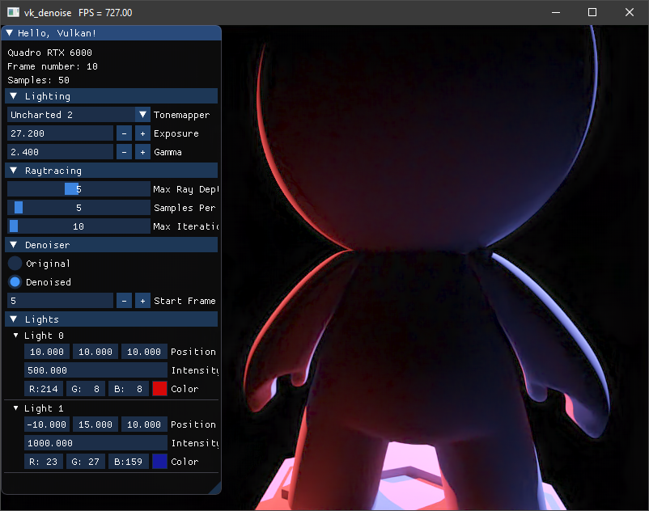
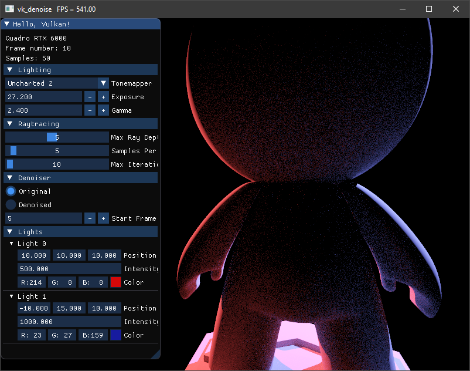

# VK_DENOISE
 

This example is an extension of the vk_raytrace example, instead of using a raytracing technique, it is using a path-tracing rendering. After a few iteration, the image will be denoised using the [Optix7 denoiser](https://developer.nvidia.com/optix-denoiser). To achieve this, an interop between Cuda and Vulkan is set. Vulkan images are converted to Cuda buffers and converted back after been denoised. This pass is insterted between other rendering passes, as it is done in vk_raytrace. 

Tags: 
- raytracing, path-tracing, GLTF, HDR, tonemapper, picking, BLAS, TLAS, PBR material, denoising, Cuda, interop

Extensions: 
- VK_KHR_GET_PHYSICAL_DEVICE_PROPERTIES_2_EXTENSION_NAME, VK_NV_RAY_TRACING_EXTENSION_NAME, VK_KHR_GET_MEMORY_REQUIREMENTS_2_EXTENSION_NAME, VK_KHR_MAINTENANCE3_EXTENSION_NAME, VK_EXT_DESCRIPTOR_INDEXING_EXTENSION_NAME,
VK_KHR_EXTERNAL_MEMORY_CAPABILITIES_EXTENSION_NAME,
VK_KHR_EXTERNAL_SEMAPHORE_CAPABILITIES_EXTENSION_NAME,
VK_KHR_EXTERNAL_FENCE_CAPABILITIES_EXTENSION_NAME,
VK_KHR_GET_PHYSICAL_DEVICE_PROPERTIES_2_EXTENSION_NAME,
VK_KHR_EXTERNAL_MEMORY_WIN32_EXTENSION_NAME,
VK_KHR_EXTERNAL_SEMAPHORE_EXTENSION_NAME,
VK_KHR_EXTERNAL_SEMAPHORE_WIN32_EXTENSION_NAME,
VK_KHR_EXTERNAL_FENCE_EXTENSION_NAME,
VK_KHR_EXTERNAL_FENCE_WIN32_EXTENSION_NAME,

